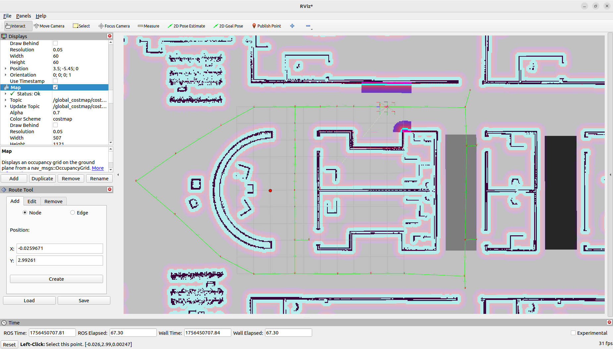
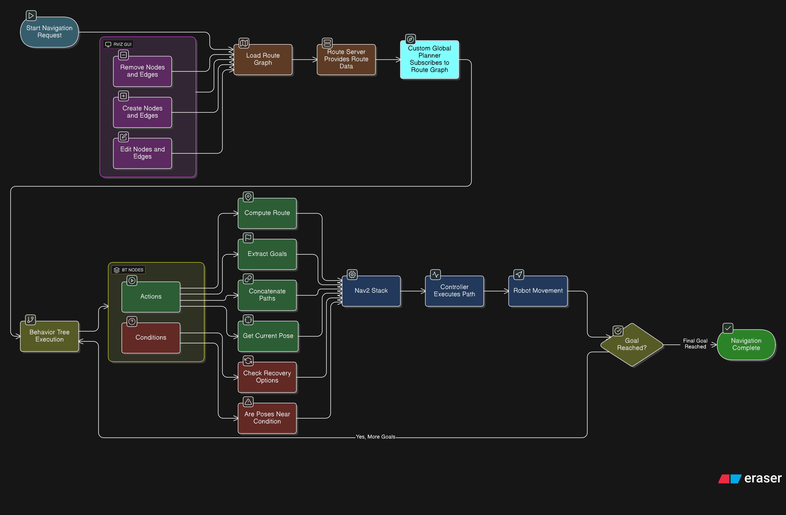

# Multi-kind-Robot-system
The package can able to launch multiple kinds of robots in a single environment
# Route Server Integration with Nav2 (ROS 2 Humble) — Step‑by‑Step Guide

This repository provides a complete implementation of the **Nav2 Route Server** pipeline in ROS 2 Humble. It integrates custom behavior tree (BT) nodes, a specialized global planner, and a GUI in RViz to achieve route-based navigation with high reliability. Unlike standard waypoint or goal-to-goal navigation, this framework enforces traversal along a pre-defined route graph, avoiding shortcuts or undesired paths.

---

## Motivation

Autonomous navigation in structured environments such as warehouses, campuses, or road-like layouts often requires robots to follow predefined paths rather than freely navigating the open space. The Nav2 Route Server, extended with custom behavior tree nodes, planners, and visualization tools, ensures that robots respect the defined topology of the environment. This approach is ideal for logistics robots, delivery robots, and any system where safety and route adherence are critical.

---
## Purpose
This README provides a complete, step‑by‑step integration guide for the Nav2 *Route Server* in ROS 2 Humble. It documents the full pipeline: preparing a GeoJSON route graph, processing it in QGIS, implementing and registering custom Behavior Tree (BT) action/condition nodes, building a route‑aware global planner, integrating everything into `nav2_params.yaml`, and using an RViz GUI for interactive graph editing. It also documents the conceptual mistakes encountered during development and the detailed fixes applied so future developers can avoid the same pitfalls.

---

## Table of Contents

1. Motivation & Overview  
2. Key Components & Features  
3. Prerequisites  
4. Step‑by‑Step Integration (detailed)  
   - 4.1 Create GeoJSON Route Graph  
   - 4.2 Process Graph in rviz using route tool or QGIS + SQL  
   - 4.3 Implement Custom Behavior Tree (BT) Nodes  
   - 4.4 Build the Custom Global Planner (route-aware)  
   - 4.5 Register Plugins & Update `nav2_params.yaml`  
   - 4.6 RViz GUI: Create/Edit/Remove Nodes & Edges  
   - 4.7 Launch Sequence & Quick Start  
5. Testing, Validation & Example Workflows  
7. Common Issues, Conceptual Errors & Solutions  
8. Best Practices & Tips  
9. Future Work & Extensions  
10. License & Credits

---

## 1. Motivation & Overview

In structured environments (warehouses, factories, campuses), robots often must follow predefined "roads" or corridors rather than free-space shortest paths. The Nav2 Route Server supports graph-based navigation: robots plan and move along nodes and edges rather than relying purely on geometric planners. This project extends Nav2 with:

- Custom BT action and condition nodes for route logic.  
- A route-aware global planner that subscribes to `/route_graph` and enforces edge adherence.  
- An RViz GUI plugin for interactive graph editing (create/edit/delete nodes & edges).  
- Full parameterization in `nav2_params.yaml` for seamless integration with Nav2.

---

## 2. Key Components & Features

**Behavior Tree Extensions**
- Action Nodes:
  - `compute_route_action`
  - `append_goal_pose_to_goals_action`
  - `concatenate_paths_action`
  - `extract_route_nodes_as_goals_action`
  - `get_current_pose_action`
  - `get_next_few_goals_action`
- Condition Nodes:
  - `would_a_controller_recovery_help_condition`
  - `would_a_route_recovery_help_condition`
  - `would_a_planner_recovery_help_condition`
  - `are_poses_near_condition`

**Custom Global Planner**
- Subscribes to `/route_graph`.  
- Validates edge connectivity and rejects shortcuts through open space.  
- Produces `nav_msgs/Path` compatible with Nav2.

**GeoJSON Route Graph**
- Nodes & edges model the environment topology.  
- Use QGIS + SQL (`generate_start_and_end_id.sql`) to assign `startid`/`endid` to edges.

**RViz GUI**
- Interactive panel to add, edit, and remove nodes and edges.  
- Exports updated graph to GeoJSON and publishes to `/route_graph`.

---

## 3. Prerequisites

- ROS 2 Humble installed and working.  
```bash
# 1. Set locale
sudo locale-gen en_US en_US.UTF-8
sudo update-locale LC_ALL=en_US.UTF-8 LANG=en_US.UTF-8
export LANG=en_US.UTF-8

# 2. Add ROS 2 apt repository
sudo apt update && sudo apt install -y software-properties-common
sudo add-apt-repository universe
sudo apt update && sudo apt install -y curl gnupg lsb-release

sudo curl -sSL https://raw.githubusercontent.com/ros/rosdistro/master/ros.key -o /usr/share/keyrings/ros-archive-keyring.gpg

echo "deb [arch=$(dpkg --print-architecture) signed-by=/usr/share/keyrings/ros-archive-keyring.gpg] \
  http://packages.ros.org/ros2/ubuntu $(lsb_release -cs) main" | \
  sudo tee /etc/apt/sources.list.d/ros2.list > /dev/null

# 3. Install ROS 2 Humble Desktop (full recommended install with RViz & demos)
sudo apt update
sudo apt install -y ros-humble-desktop

# 4. Source ROS setup
echo "source /opt/ros/humble/setup.bash" >> ~/.bashrc
source ~/.bashrc


``` 
- Navigation2 packages (`nav2_bringup`, `nav2_navfn_planner`, etc.). 
```bash
# 1. Create workspace
mkdir -p ~/nav2_ws/src
cd ~/nav2_ws/src

# 2. Clone Nav2 repository
git clone https://github.com/ros-planning/navigation2.git -b humble

# 3. Install dependencies
cd ~/nav2_ws
rosdep install -y -r -q --from-paths src --ignore-src --rosdistro humble

# 4. Build workspace
colcon build --symlink-install

# 5. Source workspace
echo "source ~/nav2_ws/install/setup.bash" >> ~/.bashrc
source ~/.bashrc

``` 
- `nav2_route_server` or your route server package source.  
- QGIS (desktop) with SQL/Virtual Layers support.  
- `colcon`, `rosdep`, `git`, and a working workspace at `~/ros2_ws`.

---

## 4. Step‑by‑Step Integration (detailed)

### 4.1 Create GeoJSON Route Graph
1. Prepare a base map (occupancy grid / (you_map_name).yaml).  
```bash
# Source setup
source /opt/ros/humble/setup.bash

# Launch Gazebo world
ros2 launch (your_package_name) gazebo.launch.py

#SLAM
ros2 launch slam_toolbox online_async_launch.py use_sim_time:=True

#Teleoperation
ros2 run teleop_twist_keyboard teleop_twist_keyboard

#Save Map
ros2 run nav2_map_server map_saver_cli -f ~/map

```

2. In QGIS:
   - Add the map and create two vector layers: **nodes** (Point) and **edges** (LineString).  
   - For nodes: include an `id` attribute (unique string or integer).  
   - For edges: include `startid` and `endid` attributes (initially blank if computed by SQL). 


   
3. Save/export both layers as GeoJSON (CRS: **EPSG:3857** recommended if your pipeline expects Web Mercator).

4. If creating a route node and edges are difficult you can create it using route_tool UI which is created in Rviz. Just create nodes using clicked_point and join nodes by edges using node numbers in the dialog box in rviz.

**Tip:** Keep node IDs human-readable (e.g., `n_01`, `n_02`). This helps debugging.

### 4.2 Process Graph in QGIS + SQL
- Use Nav2's `generate_start_and_end_id.sql` or a similar custom query as a **Virtual Layer** inside QGIS. This attaches `startid`/`endid` to each edge by spatially snapping endpoints to the nearest node. Procedure:
  1. Open DB Manager → Virtual Layers → Load SQL script.  
  2. Execute the SQL; verify `startid`/`endid` fields are populated.  
  3. Export the resulting joined layer to GeoJSON.

**Common pitfalls:**
- CRS mismatch: ensure both node and edge layers share the same CRS.  
- Virtual Layer errors: ensure you load the correct filenames and column names; use `ST_Distance` and `ST_Intersects` wisely.

### 4.3 Implement Custom Behavior Tree (BT) Nodes
- Create new C++ BT node classes (or Python if using py_trees) in your package:
  - Actions: implement `on_tick()` / `tick()` logic to interface with route server services (`compute_route`, `getAndTrackRoute`) and output route data to blackboard/ports.
  - Conditions: implement checks like `WouldARouteRecoveryHelpCondition` and `ArePosesNearCondition` with robust parameter handling (avoid assuming parameter types).
- Register plugins in a plugin XML (e.g., `resources/plugin_description.xml`).
- Update `CMakeLists.txt` and `package.xml` to build BT nodes as shared libraries.

**Example BT XML snippet (`navigate_on_route_graph_w_recovery.xml`):**
```xml
<BehaviorTree ID="NavigateRoute">
  <Sequence name="Navigate Route">
    <GetCurrentPoseAction output_key="start_pose"/>
    <ComputeRouteAction start="{start_pose}" goal="{goal_pose}" output_key="route"/>
    <ExtractRouteNodesAsGoalsAction input_key="route" output_key="goals"/>
    <GetNextFewGoalsAction input_key="goals" output_key="next_goals"/>
    <ConcatenatePathsAction input_key="next_goals" output_key="path"/>
    <FollowPath input_key="path"/>
  </Sequence>
</BehaviorTree>
```

### 4.4 Build the Custom Global Planner (route‑aware)
- Create a planner plugin (C++ recommended) that implements Nav2's planner interface (`nav2_core::GlobalPlanner`).
- Planner responsibilities:
  - Subscribe to `/route_graph` topic (or accept route server service calls).  
  - When asked to plan, validate whether start and goal lie on graph edges or nodes. If the goal is on an edge, create a virtual node (split edge) and use that.  
  - Avoid generating free-space shortcuts — filter graph edges and construct path solely from valid edges.
- Test intermediate outputs by publishing the planner's computed `nav_msgs/Path` to a topic and viewing in RViz.

**Planner YAML snippet:**
```yaml
planner_server:
  ros__parameters:
    expected_planner_ids: ["My_global_planner"]
    planner_plugins: ["my_global_planner"]
    My_global_planner:
      plugin: "your_package::my_global_planner"
      interpolation_resolution: 0.05
```

### 4.5 Register Plugins & Update `nav2_params.yaml`
- Under `bt_navigator.ros__parameters`, add `default_bt_xml_filename` and the `plugin_lib_names` list containing your BT node libraries. Example:
```yaml
bt_navigator:
  ros__parameters:
    default_bt_xml_filename: "/home/siddhu/route_ws/src/bcr_bot/behavior_trees/navigate_on_route_graph_w_recovery.xml"
    plugin_lib_names:
      - nav2_compute_route_action_bt_node
      - nav2_append_goal_pose_to_goals_action_bt_node
      - nav2_concatenate_paths_action_bt_node
      - nav2_extract_route_nodes_as_goals_action_bt_node
      - nav2_get_current_pose_action_bt_node
      - nav2_get_next_few_goals_action_bt_node
      - nav2_would_a_controller_recovery_help_condition_bt_node
      - nav2_would_a_route_recovery_help_condition_bt_node
      - nav2_would_a_planner_recovery_help_condition_bt_node
      - nav2_are_poses_near_condition_bt_node
```
- Add planner plugin in `planner_server` (see previous section).
- Ensure `route_server` parameters (e.g., graph path, pruning thresholds) are set.

### 4.6 RViz GUI: Create/Edit/Remove Nodes & Edges
- Build a custom RViz panel (C++ or Python) to:
  - Publish edits to `/route_graph` topic.  
  - Provide Create/Edit/Delete workflows with coordinate inputs or interactive clicks.  
  - Save the modified graph as GeoJSON.
- The panel should publish a full `route_graph` whenever changes are made so the route server and planner stay in sync.
  - Launch the RViz plugin to visualize and edit the route graph interactively.  
   

### 4.7 Launch Sequence & Quick Start
1. Build workspace:
```bash
colcon build --symlink-install
source install/setup.bash
```
2. Start the route server - already loaded route_server parameters in nav2_params(example launch):
```bash
ros2 launch (your_package_name) navigation.launch.py use_sim_time:=true
```

3. Open RViz and use GUI to edit graph and send goals.

---

## 5. Testing, Validation & Example Workflows

**Example test flow:**
- Create a simple rectangular route graph (A→B→C→D→A).  
- Launch everything and send a goal to move from near A to C.  
- Observe BT: `ComputeRouteAction` requests route A→B→C; `ExtractRouteNodesAsGoalsAction` produces waypoints; controllers follow interpolated paths.  
- Inject obstacle in RViz (or mark map obstacles) and validate recovery nodes are triggered: `WouldAControllerRecoveryHelpCondition` → attempt controller recovery; if unsuccessful, `WouldAPlannerRecoveryHelpCondition` → replan along alternative edges.

---
## 6. System Flow
The diagram below provides context for how the route_server package is structured from the consititutent files you'll find in this project.


This diagram is a flow of the Navigation2 (Nav2) stack in ROS 2 with custom Behavior Tree (BT) nodes and a route-based global planner.


---

## 7. Common Issues, Conceptual Errors & Solutions

This section consolidates the many conceptual errors encountered during development, with explanations and fixes. Save yourself time by reading each case.

### 7.1 Coordinate Reference System (CRS) Mismatch
**Problem:** Nodes/edges appear “out of bounds” in RViz/Gazebo.  
**Cause:** GeoJSON in QGIS used a different CRS (e.g., EPSG:4326) than the ROS map frame (EPSG:3857 / local metric).  
**Fix:** Reproject vector layers to the target CRS (EPSG:3857 recommended). Ensure map origin and resolution are consistent. Export GeoJSON after reprojection.

### 7.2 Node IDs vs Coordinates Confusion
**Problem:** Edges not associated with nodes; route server returns incomplete routes.  
**Cause:** Edge `startid`/`endid` attributes missing or mismatched.  
**Fix:** Use QGIS SQL to compute `startid`/`endid` using nearest-node logic. Verify IDs match node table.

### 7.3 Costmap Size / Rolling Window Issues
**Problem:** Planner complains robot pose or sensor origin is outside the costmap.  
**Cause:** Incorrect costmap parameters or map origin mismatch.  
**Fix:** Set global costmap size appropriately or enable rolling window. Align `global_frame` and `robot_base_frame`.

### 7.4 Treating EdgeScorers as Path Generators
**Problem:** Attempted to implement planning logic inside EdgeScorer and misconfigured YAML.  
**Cause:** EdgeScorers are scoring utilities, not planners.  
**Fix:** Implement path generation in planner plugin; use scorer plugins only for weighting edges (distance, safety penalties).

### 7.5 LifecycleNode vs rclcpp_lifecycle::LifecycleNode Mistake
**Problem:** Plugin code used incompatible node type (e.g., non-lifecycle API).  
**Cause:** Confusion between `rclcpp::Node` and `rclcpp_lifecycle::LifecycleNode`.  
**Fix:** Use correct lifecycle node types for Nav2 components that expect lifecycle semantics; convert parameter handling accordingly.

### 7.6 Parameter Typing (transform_tolerance)
**Problem:** Tried to read `transform_tolerance` as `rclcpp::Duration`.  
**Cause:** Nav2 parameters store values as primitive types (double).  
**Fix:** Declare parameter as `double` and convert to `rclcpp::Duration(seconds)` inside code.

### 7.7 Deprecated Helper Usage in BT
**Problem:** Used removed helpers like `BT::isStatusActive(status())` or `deconflictPortAndParamFrame`.  
**Fix:** Replace with current APIs (e.g., `status() != NodeStatus::RUNNING`) and manual port/parameter resolution logic.

### 7.8 Goals on Edges vs Nodes — Virtual Nodes Handling
**Problem:** Goals placed on edges didn't generate valid routes — planner returned zero edges.  
**Cause:** Planner expected node-to-node paths; goals on edges require virtual nodes.  
**Fix:** Implement logic to insert virtual nodes when a goal intersects an edge (split edge into two sub-edges and treat as nodes), then re-run route computation.

### 7.9 Plugin YAML Misconfigurations
**Problem:** Planner or BT plugins not loaded at runtime.  
**Cause:** Plugin library names not listed or plugin XML not installed.  
**Fix:** Ensure `plugin_lib_names` in `nav2_params.yaml` includes correct library basenames and that `ament_index` installed files are present. Run `ros2 pkg prefix <pkg>` to verify installation.

### 7.10 GUI in RViz  
**Problem:** Unable to launch route_tool.launch.py and RViz could not open route_tool.rviz.

**Cause:** Launch files and RViz config were missing from the installed package because CMakeLists.txt did not install the launch/ and rviz/ directories. Additionally, saving .rviz files directly in the install/ path failed since it is read-only.

**Fix:** Added install(DIRECTORY launch DESTINATION share/${PROJECT_NAME}) and install(DIRECTORY rviz DESTINATION share/${PROJECT_NAME}) in CMakeLists.txt to correctly deploy resources. Placed route_tool.launch.py under launch/ and route_tool.rviz under rviz/ in the source tree. After rebuilding with colcon build, the GUI was successfully visualized in RViz.
 
---

## 8. Best Practices & Tips

- Always test with small graphs first; scale complexity gradually.  
- Keep clear naming conventions for nodes/edges.  
- Use RViz and `ros2 topic echo` liberally to inspect messages (`/route_graph`, `/plan`, `/path`).  
- Add verbose logging to BT nodes and planner for easier debugging.  
- Maintain separate YAML files for planner, behavior tree, and route server parameters.

---

## 9. Future Work & Extensions

- Dynamic graph updates with SLAM integration.  
- Multi-robot route coordination and conflict resolution.  
- Integrate traffic rules and signals into edge scoring.  
- Support multiple CRS conversions and auto-detection.

---

## 10. License & Credits

Licensed under Apache 2.0. Thanks to the Navigation2 project, ROS 2 community, and Nav2 contributors for documentation and examples.

---

## Appendix: Useful Commands & Snippets

**Build & Source**
```bash
colcon build --symlink-install
source install/setup.bash
```

**Debug Topics**
```bash
ros2 topic list
ros2 topic echo /route_graph
ros2 service list
ros2 run nav2_simple_commander example_route
```

**Sample `nav2_params.yaml` excerpt**
```yaml
bt_navigator:
  ros__parameters:
    default_bt_xml_filename: "/home/siddhu/route_ws/src/bcr_bot/behavior_trees/navigate_on_route_graph_w_recovery.xml"
    plugin_lib_names: ["nav2_compute_route_action_bt_node", "nav2_are_poses_near_condition_bt_node"]
planner_server:
  ros__parameters:
    planner_plugins: ["my_global_planner"]
    my_global_planner:
      plugin: "your_package::my_global_planner"
```

---
## Conclusion

This project demonstrates a robust pipeline for route-based navigation in Nav2 Humble. By combining **Route Tool, GeoJSON route graphs, QGIS processing, custom BT nodes, a global planner, and an RViz GUI**, it ensures reliable and structured navigation. This approach provides a foundation for large-scale deployments of autonomous robots where safety and strict path adherence are required.


